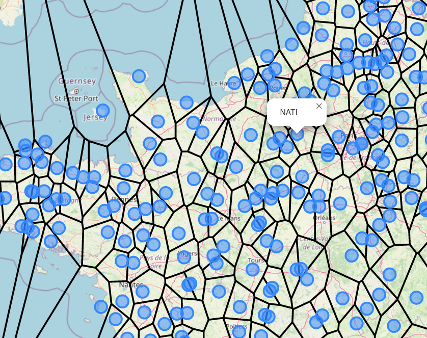

# Voronoi map for centipede

Test to show how a map can be generated using voronoi diagram from GNSS caster (here centipede)

Build with d3 so with 

An example of output: 

to build the test.png file:
```
npm install
npm run build
```
to be able to use this on a browser, you will have to:
- serve `public/index.html` file from a server (let say in the context /{context})
- serve the `dist` directory on `/{context}/dist`
- make a proxypass to your caster table so that there is no cors issue. The path has to be `/caster`

I put a Dockerfile to create an nginx server with that. The nginx configuration is `nginx/default.conf` file the Dockerfile `dockerfile`

with that, you can:

```
docker build -t test .
docker run  -p 8080:80 --rm test
```

Open your browser on http://localhost:8080/ and you should see the map.
